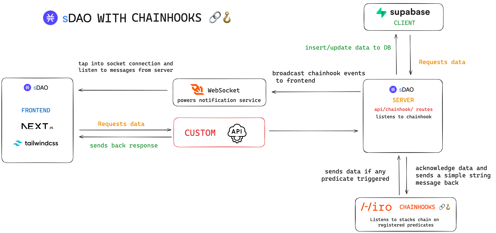

# sDAO WITH CHAINHOOKS 🔗🪝 

milestone based funded decentralized grants program

features:

build on top of [sDAO](https://github.com/Aman-zishan/sDAO
)

- Boostrap process now hooked with chainhook to know for sure if transaction went through
- notification service by making use of websocket to notify user about the chain state change
- Server side database insertion for chainhook events instead of assuming request went through
- alerts the user if the trasaction went through or not (which was assumed in sDAO)

# short video demo (7 mins)

link: https://youtu.be/aDuB2fzSNM8

## Getting Started

To get the application running, follow these steps:

1. Clone the repository: `git clone https://github.com/Aman-zishan/sDAO-with-chainhook.git`
1. Navigate into the directory: `cd sDAO-with-chainhook`
2. Install the dependencies: `yarn install`
3. Start the development server: `yarn dev`
4. In another terminal run the server: `node sdao-api/server.js` (should be run from root directory)

## Setup

Before getting into testing the application you need to spin up the devnet. This applications uses devnet to interact with the smart contract. To spin up the devnet, follow these steps:

In a new terminal session run the command:

1. `clarinet integrate`
2. Once the devnet is up and running, import wallets to different browser accounts
3. Import deployer wallet, go to `settings/Devnet.toml` and copy the mnemonic of the deployer account
5. Similarly import the mnemonic of any other wallet to be the member of DAO make sure the account you import has membership token balance

## Demo

1. Connect the deployer wallet to the application

2. Go to `Bootstrap DAO` page and follow the instructions listed in bootstrap page one by one (user should be deployer for this action)
   
5. Once the bootstrap is completed you can deploy and propose grant via `new grant proposal` page

6. After proposing new grant you will recieve a notification if the proposal was submitted succesfully, find the grant under `your proposals` , vote and conclude. You can also connect via another wallet and vote for the grant

7. click on `conclude` to conclude and execute the proposal

8. once succcesfull go ahead and repeat the process for claiming the milestone, make sure to change the `contract` in boilerplate `.grant-proposal` to your newly deployed grant contract

9. vote and conclude just like grant proposal

10. You should be able to see the stx transfer event from the contract wallet to the provided recipient

11. During each transaction you should be able to see the hooks triggered and server logs like shown in the above screenshot
   
